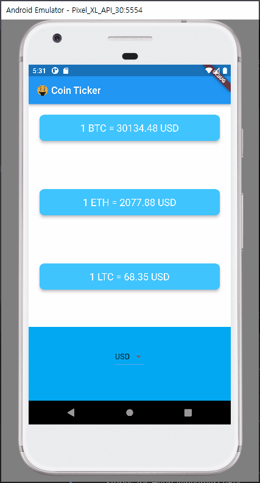

# Coin Ticker

API를 이용해 가상화폐 가격을 표시해주는 앱을 만들었습니다.

## 이번 앱을 만들면서 배운 점

- Layout Shift를 방지할 수 있는 법을 알았습니다.
- *??=* 널일 경우 어떠한 값을 할당할 수 있는 키워드를 알 수 있었습니다. 또한 **...** 스프레드 연산자를 통해 코드를 직관적이고 간략하게 작성할 수 있었습니다.
- IOS, Android의 고유 UI를 사용할 수 있도록 분기할 수 있는 방법을 배웠습니다.
  - 더불어 Cupertino 클래스들을 사용해 iOS 사용자들에게 친숙한 UI를 제공할 수 있음을 알게되었습니다.
- 코드를 모듈화 하여 직관적인 코드를 작성할 수 있었습니다.

## 실제화면

