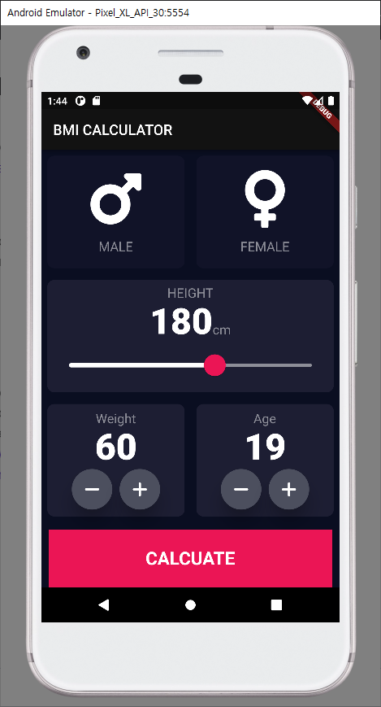
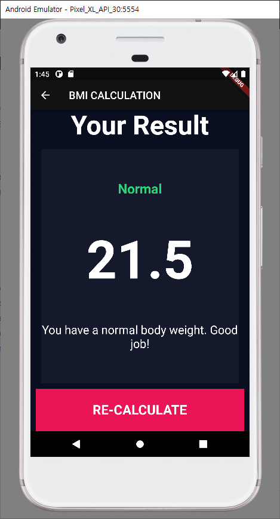

# BMI Calculator

사용자로부터 키와 몸무게 정보를 입력받아 BMI(Body Mass Index)를 계산할 수 있는 앱을 만들었습니다.

## 이번 앱을 만들면서 배운 점

- Navigator를 이용해 화면이동을 배울 수 있었습니다.**Route**를 네이밍하여 쉽게 이동할 수 있음도 배웠습니다.
- 열거형 데이터 타입인 **Enum**을 배우고 활용함으로써 유지보수 측면에서 향상된 코드를 작성할 수 있었습니다.
- Slider를 커스텀하기 위해 SliderThemeData를 활용해봄으로써 기본 제공되는 위젯을 커스텀 할 수 있음을 알 수 있었습니다.
- callback 함수에 대해 알 수 있었습니다.
- const와 final에 대한 차이를 인지하면서 Function void의 차이에 대해서 알 수 있었습니다.

## 실제화면

