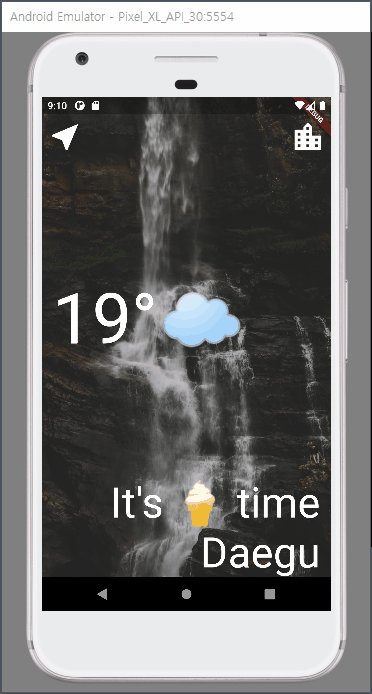

# Clima

API를 이용해 현재 살고 있는 지역 그리고 검색기능을 통해 원하는 지역의 날씨를 검색할 수 있는 앱을 만들었습니다.

## 이번 앱을 만들면서 배운 점

- Flutter의 내장 API인 Navigator에 대해서 심층적으로 파악할 수 있었습니다.
  - Navigator.pop() Method 사용 시 데이터를 함께 넘겨주어 UI를 개선할 수 있었습니다.
- Async Await 그리고 Future 키워드를 사용하면서 동기 비동기에 대한 이해를 높일 수 있었습니다.
- StatefullWidget과 State클래스에 대해 이해할 수 있었습니다.
  - widget, mounted 프로퍼티에 대해 이해를 통해 Loading Screen과 Navigator를 통해 넘겨진 변수를 State클래스에서 접근할 수 있는 것을 알 수 있었습니다.
- 작성된 코드를 모듈화하면서 간결한 코드를 작성할 수 있는 법을 알 수 있었습니다.
- InputFeild를 이용해 사용자의 값을 입력받을 수 있음을 인지했습니다.
- 위치 관련 라이브러리인 Geolocator를 이용해 사용자의 위치를 파악했습니다.
  - GPS 사용자 권한 체크
  - 권한이 부여되지 않았을 경우 라이브러리를 이용해 설정탭으로 들어갈 수 있도록 했습니다.

## 실제화면

