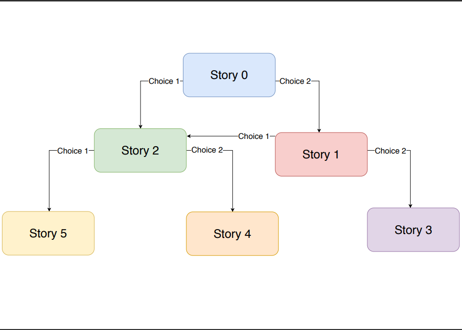
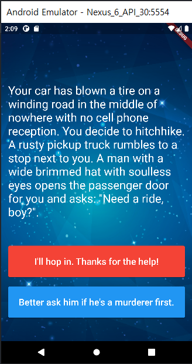

# Destini
플레이스토어에 한 때 다운로드 수 1위를 했었던 서울 42와 같은 사용자의 선택에 따라 바뀌는 게임을 만들어 봤습니다. 스토리 라인은 다음의 사진과 같습니다.

## 이번 앱을 만들면서 배운 점
- 앱 화면의 백그라운드 이미지를 BoxDecoration을 이용해 적용할 수 있음을 배웠습니다.
- Named Parameter에 대한 이해와 적용을 통해 Dart class에 대한 개념을 명확히 할 수 있었습니다.
- Dart2.0 이후 부터 바뀐 class property의 late, required 예약어에 대해 배울 수 있었습니다.
- getter, setter 그리고 접근제한자 _ 를 배울 수 있었습니다.
- Visibility Widget을 통해 Widget을 동적으로 사용자에게 보여줄 수 있음을 알 수 있었습니다.

## 앱 화면
