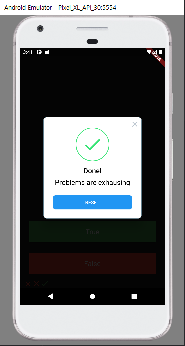
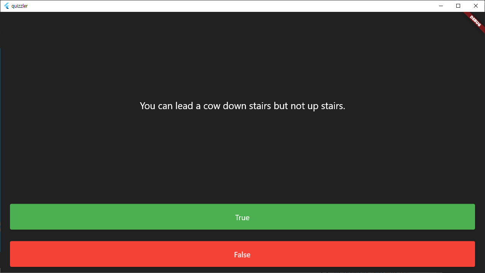

# Quizzler

OX퀴즈를 할 수 있는 앱입니다. 앱을 만들면서, State에 대한 이해 그리고 OOP(Object oriented Programming)에 대한 개념을 다시한번 되새길 수 있었습니다. 또한 Flutter프레임워크의 기반이 되는 Dart언어의 문법 특히 Class에 대한 부분을 깊이 이해할 수 있었습니다.

간단하게나마 앱이 가지고있는 Context에 대한 이해와 함께 Navigator에 대한 이해도 할 수 있었습니다.

## Picture

